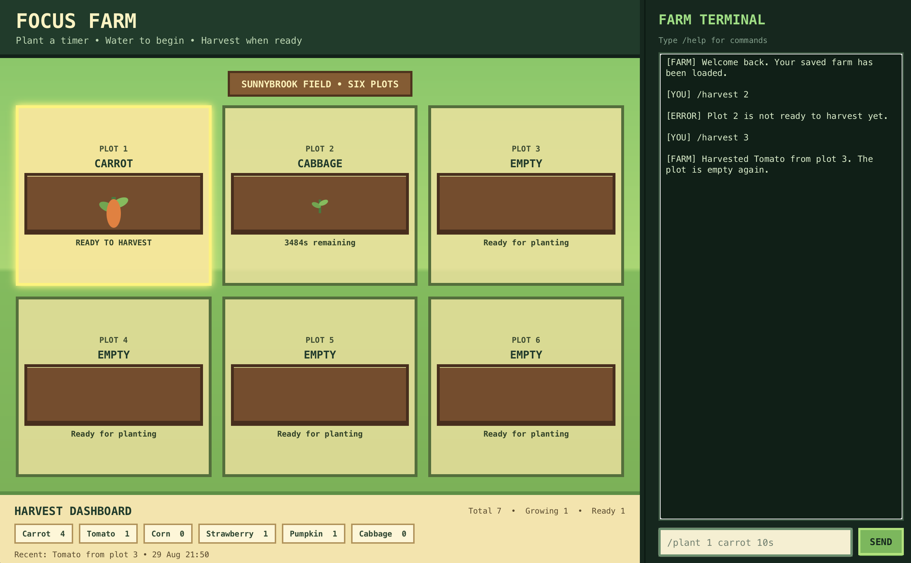

# Focus Farm

Focus Farm is a JavaFX desktop countdown timer and harvest tracker presented as
a small pixel-inspired farm. Plant a crop, water it to begin a timer, fertilize
it once to shorten the wait, and harvest it when it is ready.



This project is developed individually for NUS CS3227 MP1 using Java SE 25.

## Development commands

```bash
./gradlew run
./gradlew clean check
./gradlew release
```

See [docs/UserGuide.md](docs/UserGuide.md) for user instructions.
See [docs/DeveloperGuide.md](docs/DeveloperGuide.md) for Developer instructions.