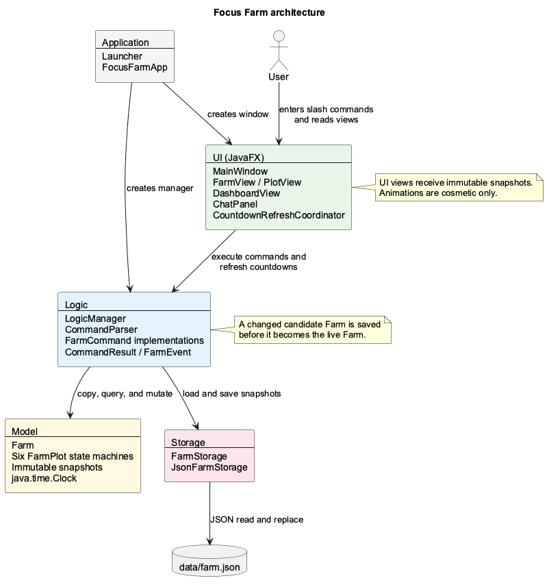
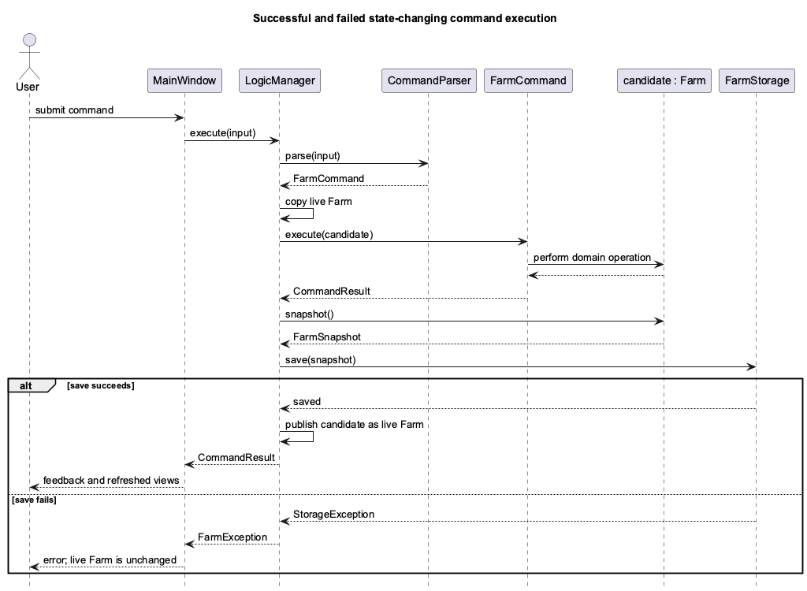
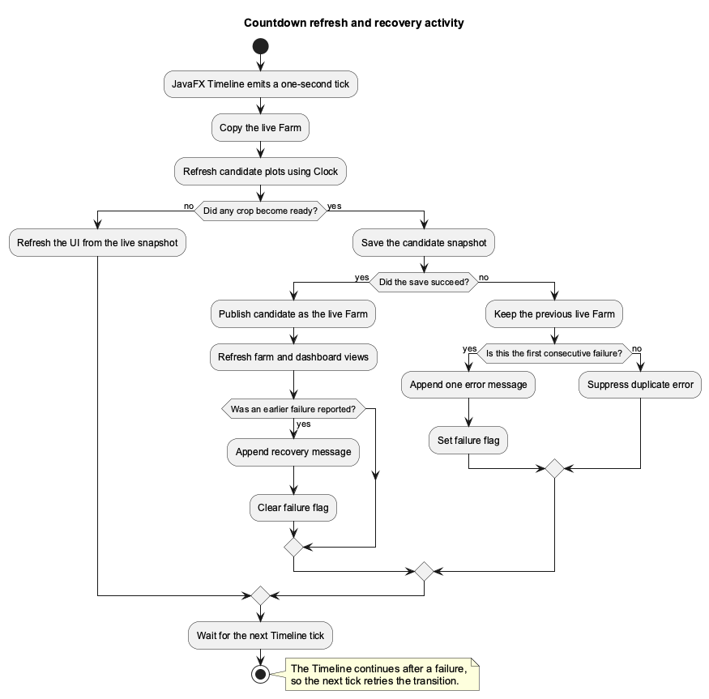
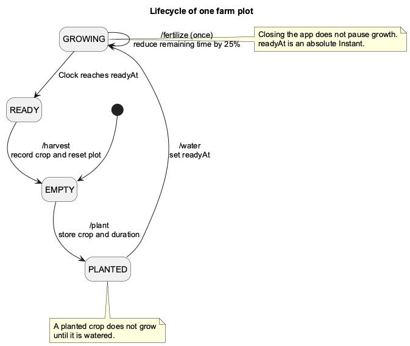

# Focus Farm Developer Guide

## 1. Introduction

Focus Farm is a Java desktop countdown timer and harvest tracker. It presents
six independent timers as farm plots: users plant a crop, water it to start a
countdown, may fertilize it once, and harvest it after the countdown completes.

The product is deliberately not a task manager. It stores no task description,
deadline, priority, or done/not-done state. Its durable information is limited
to plot timers, crop inventory, and harvest history.

This guide starts with the system as a whole, explains the workflows that cross
component boundaries, and then describes each component in more detail.

### 1.1 Design goals

- Keep all authoritative farm state outside JavaFX.
- Make countdown results independent of UI frame timing and application uptime.
- Prevent the UI from displaying a change that failed to reach persistent
  storage.
- Keep the fixed six-plot MVP small enough to test comprehensively.
- Require no account, network service, API key, telemetry, or runtime LLM.
- Use only original, generated, or properly attributed assets.

## 2. Technology and repository structure

### 2.1 Technology

| Purpose | Technology |
| --- | --- |
| Language and runtime | Java SE 25 |
| Desktop interface | JavaFX 25.0.4 |
| Build | Gradle 9.1 wrapper |
| JSON persistence | Jackson 2.22.2 |
| Unit testing | JUnit Jupiter 5.14.4 |
| Style checking | Checkstyle 14.0.0 |
| Coverage | JaCoCo 0.8.15 |
| CI | GitHub Actions |

### 2.2 Repository structure

| Path | Responsibility |
| --- | --- |
| `src/main/java/.../focusfarm` | Application entry points |
| `src/main/java/.../ui` | JavaFX views and refresh coordination |
| `src/main/java/.../logic` | Parsing, commands, and application coordination |
| `src/main/java/.../model` | Farm state, timing rules, and immutable snapshots |
| `src/main/java/.../storage` | Persistence interface and JSON implementation |
| `src/test/java` | Deterministic automated tests and UI snapshot harness |
| `src/main/resources/styles` | JavaFX styling |
| `docs` | User, developer, and reflection documentation |
| `release` | Runnable JAR for Windows x64, Linux x64, and macOS ARM64 |

## 3. Architecture

Focus Farm uses a layered architecture. The UI depends on the logic facade;
logic coordinates the JavaFX-independent model and storage layers. Neither the
model, command classes, nor storage classes depend on JavaFX.



### 3.1 Component overview

| Component | Main responsibility | Communicates with |
| --- | --- | --- |
| Application | Create storage, logic, and the JavaFX window; coordinate shutdown | UI, Logic |
| UI | Accept commands and display snapshots, feedback, countdowns, and animations | User, Logic |
| Logic | Parse commands, enforce save-before-publish semantics, and expose snapshots | UI, Model, Storage |
| Model | Enforce plot lifecycle, time, inventory, and history rules | Logic |
| Storage | Load and atomically replace schema-versioned JSON snapshots | Logic, file system |

The model is the source of truth. The UI receives immutable `FarmSnapshot` and
`PlotSnapshot` records; it cannot mutate a farm by holding a reference to a
domain object. `FarmEvent` values can trigger UI animations, but those
animations never change model state.

## 4. System workflows

These workflows explain the collaborations between layers before the
component-specific details.

### 4.1 Application startup and shutdown

`Launcher` starts `FocusFarmApp` through `Application.launch`.
`FocusFarmApp.init()` creates a `JsonFarmStorage` for `data/farm.json` and a
`LogicManager` using the system UTC clock.

During construction, `LogicManager`:

1. loads the optional persisted snapshot;
2. restores and validates the six-plot farm when data is present;
3. otherwise creates an empty farm; and
4. exposes a startup or recovery message for the terminal.

`FocusFarmApp.start()` creates and shows `MainWindow`. The window starts one
JavaFX `Timeline` that requests a countdown refresh every second. CI can launch
the packaged application with `--smoke-test`; the production window is shown
and then closes automatically after JavaFX has initialized.

`/exit` saves before it returns a successful exit request. Only then does
`MainWindow` schedule `Platform.exit()`. A normal window close also invokes
`FocusFarmApp.stop()` and attempts a final save, but a failure at that late
lifecycle stage can only be reported to standard error. This is why the User
Guide recommends `/exit`.

### 4.2 State-changing command execution

The central consistency rule is **save before publish**. `LogicManager` never
applies a state-changing command directly to the live `Farm`.



The sequence is:

1. `CommandParser` validates the syntax and constructs a `FarmCommand`.
2. `LogicManager` creates an independent copy of the live farm.
3. The command invokes the candidate farm's public API.
4. `LogicManager` saves the candidate snapshot.
5. Only after a successful save does the candidate become the live farm.

Parsing or domain errors occur before saving. A storage failure discards the
candidate, so the visible farm cannot retain an unpersisted command.

`/help` and `/status` are read-only and do not write storage. `/exit` is also
read-only with respect to farm state, but deliberately requests an explicit
save before shutdown.

### 4.3 Countdown refresh and storage recovery

The JavaFX timeline ticks once per second, but elapsed wall-clock time—not the
number of ticks—determines readiness. On each tick, `LogicManager` refreshes a
candidate farm. It saves only if at least one crop changes from `GROWING` to
`READY`.



`CountdownRefreshCoordinator` keeps the timeline running after a failed save.
It reports the first consecutive failure, suppresses duplicate errors, retries
on later ticks, and announces recovery after the first successful retry. The
previous live farm remains visible until its ready transition is persisted.

### 4.4 Plot lifecycle

Each `FarmPlot` is an independent state machine:



Invalid transitions throw `FarmException` and never change the live farm.
Examples include watering an empty plot, fertilizing a planted or ready crop,
fertilizing twice, and harvesting before readiness.

## 5. Component design

### 5.1 Application component

`Launcher` is a classpath-safe entry point. It delegates to `FocusFarmApp`,
which owns JavaFX lifecycle methods and creates the top-level dependencies.
Dependency construction is intentionally small and explicit:

- `JsonFarmStorage(Path.of("data", "farm.json"))` stores the farm relative to
  the process working directory.
- `Clock.systemUTC()` supplies authoritative production time.
- `LogicManager` receives both dependencies.
- `MainWindow` receives the logic facade and `Platform::exit` callback.

### 5.2 UI component

`MainWindow` assembles a 70:30 `SplitPane`. The left side contains the farm and
dashboard; the right side contains the terminal. The stage starts at 1280 × 800
and enforces a minimum size of 980 × 650.

The UI classes have narrow presentation roles:

- `FarmView` owns the two-row, three-column plot grid.
- `PlotView` renders one immutable plot snapshot and plays a short cosmetic
  pulse after successful plot commands.
- `CropGraphic` draws crop stages using original JavaFX shapes.
- `DashboardView` renders crop inventory, total harvests, growing and ready
  counts, and the newest harvest.
- `ChatPanel` submits non-blank text by Enter or the **SEND** button and appends
  `[YOU]`, `[FARM]`, or `[ERROR]` transcript entries.
- `CountdownRefreshCoordinator` isolates retry and message-suppression state
  from `MainWindow`.

`MainWindow.refreshFarm()` obtains one `FarmSnapshot` and passes it to both
`FarmView` and `DashboardView`. The UI does not advance time or write storage.

### 5.3 Logic component

`CommandParser` trims input, splits on one or more whitespace characters, and
matches command keywords without regard to case. It accepts exactly these
commands:

- `/plant <plot> <crop> <duration>`
- `/water <plot>`
- `/fertilize <plot>`
- `/harvest <plot>`
- `/status`
- `/help`
- `/exit`

`DurationParser` accepts one or more decimal digits followed by `s` or `m`.
The parser converts the value to `Duration`; `FarmPlot` then enforces the
inclusive 10-second to 60-minute domain range.

Every `FarmCommand` returns a `CommandResult` containing:

- user-facing feedback;
- a `FarmEvent` for optional presentation feedback;
- an optional plot ID;
- whether state changed; and
- whether exit was requested.

`LogicManager` is the only facade used by the UI. It owns the live farm and
coordinates parsing, copying, mutation, storage, publication, growth refresh,
snapshot reads, and explicit close saves.

### 5.4 Model component

`Farm` owns exactly six `FarmPlot` objects, an `EnumMap` inventory for all six
crop types, and newest-first harvest history. History is capped at 100 records;
inventory totals are not capped.

The available crops are `CARROT`, `TOMATO`, `CORN`, `STRAWBERRY`, `PUMPKIN`,
and `CABBAGE`. Any crop can be planted in any empty plot.

`FarmPlot` owns the state-specific fields:

| Field | Meaning |
| --- | --- |
| `id` | Stable one-based plot number |
| `crop` | Crop in the plot, or null while empty |
| `state` | `EMPTY`, `PLANTED`, `GROWING`, or `READY` |
| `growthDuration` | User-configured original duration |
| `readyAt` | Absolute maturity time after watering |
| `fertilized` | Whether fertilizer has been used for this crop |

Fertilizer subtracts one quarter of the remaining `Duration` from `readyAt`.
The calculation occurs after refreshing at the current instant, so fertilizer
cannot be applied to a crop that has already matured.

`Farm.snapshot()` and `FarmPlot.snapshot()` are observational. They calculate
display data but never change lifecycle state. Remaining seconds use
millisecond ceiling division so a newly started ten-second timer displays
`10s` rather than `11s`.

### 5.5 Time design

All authoritative time decisions use an injected `java.time.Clock`.
`FarmPlot.water()` stores `readyAt = now + growthDuration`, and
`FarmPlot.refresh()` changes a growing crop to ready when `now` is not before
`readyAt`.

Persisting an absolute `Instant` means:

- growth continues while the app is closed;
- delayed or skipped JavaFX frames do not delay maturity; and
- tests can use `MutableClock` instead of `Thread.sleep`.

The JavaFX `Timeline` is therefore only a request to refresh the displayed
state; it is not the timer's source of truth.

### 5.6 Storage component

`FarmStorage` defines optional load and snapshot save operations.
`JsonFarmStorage` implements them with Jackson and a schema-versioned envelope.
The current schema version is 1.

Saving follows this process:

1. create the parent directory when needed;
2. write indented JSON to sibling file `farm.json.tmp`;
3. atomically move it over `farm.json`; and
4. fall back to a normal replacement if the file system does not support an
   atomic move.

If loading finds malformed JSON, an unsupported schema, or incomplete data,
`JsonFarmStorage` tries to move the original file to
`farm.json.corrupt-yyyyMMdd-HHmmss` using a UTC timestamp. `LogicManager` then
starts an empty farm and exposes the recovery result in the terminal. Restored
farms are also validated for six ordered plots, valid lifecycle fields,
duration bounds, and non-negative inventory counts.

## 6. Software engineering process

### 6.1 Git workflow

The primary branch is `master`. Development occurs on purpose-prefixed,
short-kebab-case branches such as `feat-build-app`,
`bug-fix-timer`, or `doc-polish-documentation`.

Commits should remain small and coherent by feature or engineering concern.
Tests are committed with the behavior they verify. Observable behavior changes
also require corresponding documentation, interaction-log, and reflection
updates where relevant.

### 6.2 Local quality gate

Run:

```bash
./gradlew clean check
```

The gate compiles with `-Xlint:all -Werror`, generates warning-free Javadocs,
runs Checkstyle, executes JUnit, and enforces at least 80% line and 70% branch
coverage for model, logic, and storage packages. Generated API documentation is
available at `build/docs/javadoc/index.html`. UI code is manually inspected
because JavaFX rendering is not meaningfully verified by unit coverage alone.

- compiles with `-Xlint:all -Werror`;
- runs Checkstyle with zero warnings allowed;
- executes the JUnit test suite; and
- requires at least 80% line and 70% branch coverage for the model, logic, and
  storage packages.

UI classes are excluded from the numerical coverage threshold because unit
coverage does not verify JavaFX layout or rendering. UI coordination logic is
still tested where it can be isolated deterministically.

### 6.3 Testing strategy

| Area | Automated evidence |
| --- | --- |
| Plot model | Valid and invalid lifecycle transitions, duration bounds, exact readiness, and fertilizer calculation |
| Farm model | Six-plot behavior, inventory, history, restoration, and clock-driven refresh |
| Parsing | Commands, case, whitespace, argument counts, crop names, plot values, and durations |
| Logic | Read-only commands, transactional command saves, time-transition saves, failures, exit, and retry |
| Storage | Missing files, round trips, schema rejection, corrupt-file backup, and directory creation |
| UI coordination | Retry, duplicate-error suppression, recovery notification, and UI refresh callback |

Time tests advance `MutableClock` and never sleep. Storage failure tests inject
test doubles so both rejection and recovery are deterministic.

Generate a deterministic GUI screenshot for visual inspection with:

```bash
./gradlew snapshotUi
```

The task writes `build/visual/focus-farm.png`. Manual acceptance testing still
checks the 70:30 layout, window resizing, command entry, one-second countdown
updates, cosmetic animations, dashboard changes, restart behavior, and the
packaged JAR.

### 6.4 Continuous integration and release

GitHub Actions runs `./gradlew clean check` and builds the cross-platform fat
JAR on Ubuntu, Windows, and macOS. Each build includes the JavaFX native
libraries for Windows x64, Linux x64, and macOS ARM64. The matrix provides
separate build evidence for each supported operating system.

For a local release:

```bash
./gradlew clean check release
java -jar release/FocusFarm.jar
```

`release` depends on `fatJar` and copies the cross-platform `FocusFarm.jar` into
`release/`. It also runs `verifyUniversalJar`, which checks for the native Glass
runtime and application class for every supported operating system. CI then
launches that JAR with `--smoke-test` on Windows, Linux, and macOS. Linux uses
`xvfb-run` to provide a virtual display, and every smoke-test step has a bounded
timeout. A release is complete only after the quality gate and packaged-JAR
smoke test succeed on every supported platform.

## 7. Acknowledgements

### 7.1 Reused ideas and documentation

- The component separation and command architecture were informed by the
  CS2103/T AddressBook-Level3-derived tP.
  That project and AB3 are available under the MIT License. No address-book
  domain classes, commands, or assets were copied into Focus Farm.
- JavaFX provides the desktop UI and animation APIs.
- Jackson provides JSON serialization.
- JUnit, Checkstyle, JaCoCo, and Gradle provide automated verification.
- OpenAI Codex was used for requirements analysis, planning, implementation,
  test generation, review, and documentation. All output remains subject to
  human verification by the student.
- Greptile AI used as an extra pair of eyes for PR Code Reviews.
