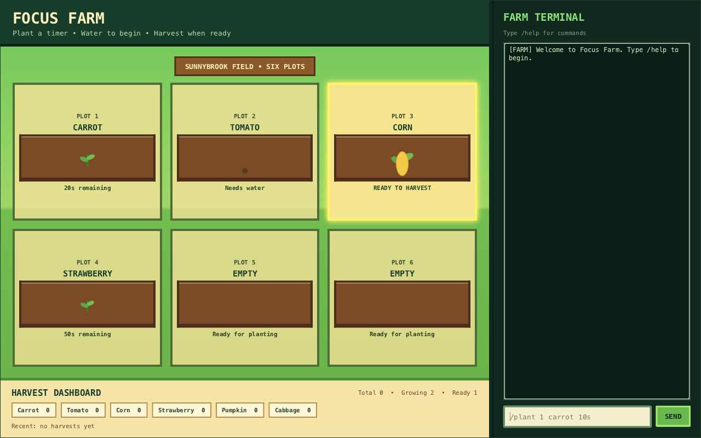
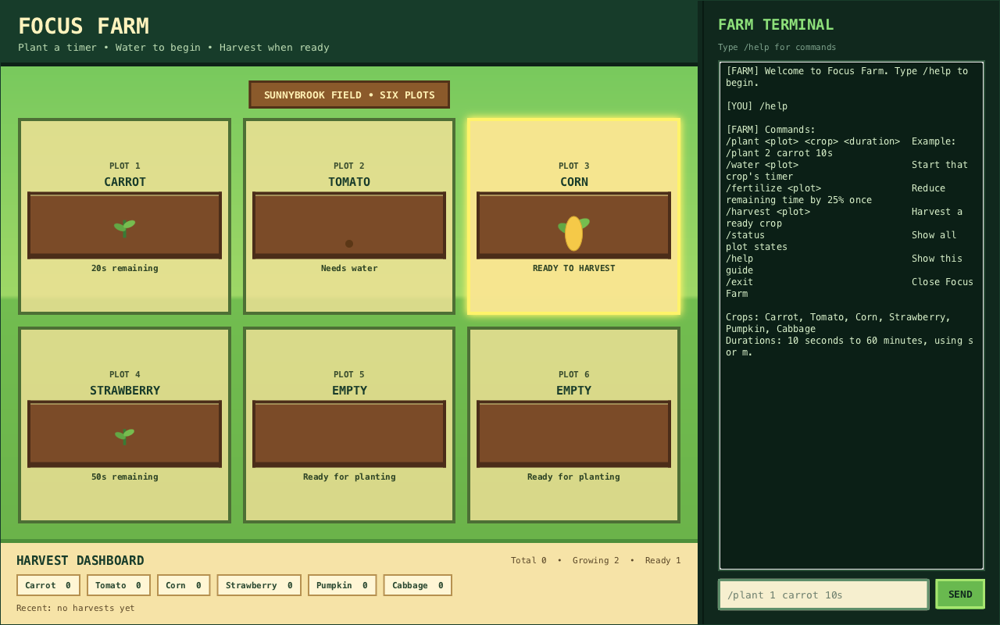

# Focus Farm User Guide

Focus Farm is a desktop countdown timer and harvest tracker presented as a
small farm. Each of its six plots is an independent timer: plant a crop, water
it to begin the countdown, optionally fertilize it once, and harvest it when it
is ready.

## Quick start

### Requirements

- Java 25
- Windows, Linux, or macOS
- A display resolution of at least 980 × 650

The packaged JAR contains JavaFX native libraries for one platform. Use a JAR
built for your operating system and CPU architecture. The JAR checked into this
repository is built for macOS on Apple Silicon; the project's CI produces
separate Windows, Linux, and macOS artifacts.

### Run the packaged application

From the repository root:

```bash
java -jar release/FocusFarm.jar
```

If the command reports a Java version error, run `java -version` and confirm
that Java 25 is active.

### Run from source

From the repository root on macOS or Linux:

```bash
./gradlew run
```

On Windows:

```bat
gradlew.bat run
```

The Gradle wrapper downloads the required build dependencies automatically.

## Interface tour



1. **Farm plots** show the crop and its current state. A growing crop also
   displays its remaining time.
2. **Harvest dashboard** shows each crop's inventory count, total harvests,
   number of growing and ready plots, and the most recent harvest.
3. **Farm terminal** records commands, responses, and errors.
4. **Command box** accepts a slash command. Press Enter or select **SEND** to
   submit it.

All state changes are made through the command box. The plot graphics and
animations provide feedback but are not clickable controls.

## Two-minute test

Use this walkthrough to test the complete crop lifecycle:

1. Plant a ten-second carrot timer in plot 1:

   ```text
   /plant 1 carrot 10s
   ```

2. Start its countdown:

   ```text
   /water 1
   ```

3. While it is growing, shorten its current remaining time by 25%:

   ```text
   /fertilize 1
   ```

4. Wait until plot 1 displays `READY TO HARVEST`, then enter:

   ```text
   /harvest 1
   ```

5. Confirm that the carrot inventory and total harvest count increased, then
   inspect all plots:

   ```text
   /status
   ```

6. Save and close Focus Farm:

   ```text
   /exit
   ```

7. Start Focus Farm again from the same folder. The carrot inventory should
   still contain the harvest.

## Command reference

Every command begins with `/`. Command words, crop names, and duration suffixes
are case-insensitive. Extra spaces between words are accepted.

| Command | What it does | When it succeeds |
| --- | --- | --- |
| `/plant <plot> <crop> <duration>` | Places a crop and configures its timer | The selected plot is empty and the inputs are valid |
| `/water <plot>` | Starts the configured timer | The crop is planted but has not been watered |
| `/fertilize <plot>` | Removes 25% of the current remaining time | The crop is growing and has not been fertilized |
| `/harvest <plot>` | Adds a mature crop to the inventory and empties the plot | The plot displays `READY TO HARVEST` |
| `/status` | Prints the state of all six plots | Always |
| `/help` | Prints the command summary | Always |
| `/exit` | Saves the farm and closes the application | The save succeeds |



### Plant

```text
/plant <plot> <crop> <duration>
```

- `<plot>` must be a number from `1` to `6`.
- `<crop>` must be `carrot`, `tomato`, `corn`, `strawberry`,
  `pumpkin`, or `cabbage`.
- `<duration>` must be from 10 seconds to 60 minutes, inclusive.
- Use `s` for seconds or `m` for minutes, for example `30s` or `5m`.
- Planting stores the duration but does not start the countdown.

Example:

```text
/plant 2 tomato 5m
```

### Water

```text
/water <plot>
```

Watering a planted crop starts its countdown. Each crop can be watered only
once.

### Fertilize

```text
/fertilize <plot>
```

Fertilizer can be used once per crop while it is growing. It removes 25% of
the remaining time at the moment the command is accepted; it does not remove
25% of the original duration.

### Harvest

```text
/harvest <plot>
```

A crop can be harvested only after its plot displays `READY TO HARVEST`.
Harvesting increments that crop's inventory count, records it as the most
recent harvest, and resets the plot to empty.

### Status, help, and exit

```text
/status
/help
/exit
```

`/status` lists every plot in the terminal. `/help` shows the in-app command
summary. `/exit` confirms that the current farm was saved before closing.

## Saving and recovery

Focus Farm saves successful state-changing commands automatically. It also
saves a time-driven transition when a growing crop becomes ready. Farm data is
stored in `data/farm.json` relative to the folder from which Focus Farm was
started.

Watered crops use absolute readiness timestamps, so they continue to grow while
the application is closed.

Use `/exit` when possible. Closing the window also attempts to save, but
`/exit` can display a save error and keep the application open for another
attempt.

If a command cannot be saved, the command is rejected and the visible farm
remains unchanged. If a crop becomes ready while saving is unavailable, Focus
Farm reports the first error, keeps retrying once per countdown tick, and
announces when saving recovers.

If `data/farm.json` is unreadable or uses an unsupported schema, Focus Farm
tries to move it to a timestamped `farm.json.corrupt-*` backup, reports what
happened in the terminal, and starts with an empty farm. If the backup cannot
be created, the terminal says so.

## Troubleshooting

### The application does not start

1. Run `java -version` and check that it reports Java 25.
2. Confirm that the JAR matches your operating system and CPU architecture.
3. If using the source checkout, run the platform-appropriate Gradle command
   from the repository root.

### A command is rejected

Read the `[ERROR]` entry in the terminal. Invalid commands do not partially
change the farm. Use `/help` to confirm the syntax and `/status` to inspect the
current plot states.

### Start a separate test farm

Farm data belongs to the folder from which the application is started. To
avoid changing an existing farm, copy the correct platform JAR into a new empty
folder and run it there. That folder receives its own `data/farm.json`.

## Current limitations

- The farm always contains exactly six plots.
- Fertilizer is unlimited, but each planted crop can receive it only once.
- There is no currency, shop, weather, farmer movement, sound, or network
  feature.
- Plots cannot be changed directly with the mouse; commands are the only input.
